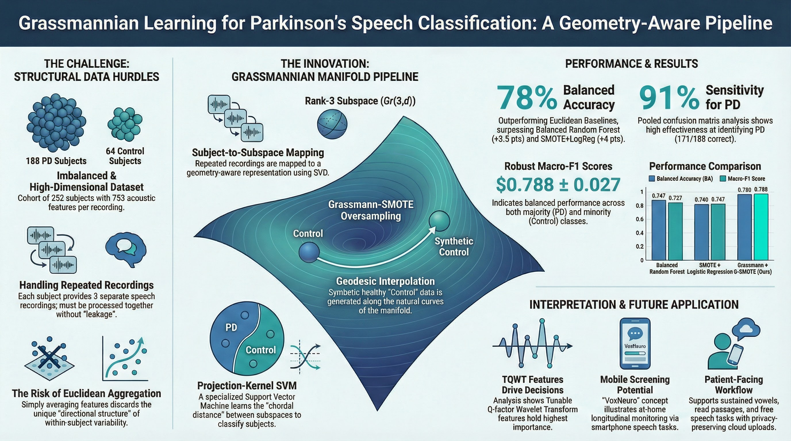

# Grassmannian Projection-Kernel Learning for Imbalanced Parkinsonian Speech Classification

**Author:** Laiba Khan, Lexington High School, MA, USA



## Overview

This repository contains the paper, reproducible experiment code, and data for a geometry-aware approach to Parkinson's disease (PD) speech classification. The method maps each subject's repeated speech recordings to a point on the Grassmann manifold Gr(3,d), then classifies using a projection-kernel SVM with Grassmann-SMOTE for class imbalance.

**Key results** (subject-level, 5-fold GroupKFold):

| Method | Balanced Accuracy | macro-F1 |
|---|---|---|
| **Grassmann + G-SMOTE (Ours)** | **0.780 ± 0.029** | **0.788 ± 0.027** |
| Balanced Random Forest | 0.747 ± 0.022 | 0.727 ± 0.024 |
| SMOTE + Logistic Regression | 0.740 ± 0.044 | 0.747 ± 0.046 |
| Logistic Regression (balanced) | 0.735 ± 0.047 | 0.739 ± 0.049 |

## Dataset

The experiment uses the [Parkinson's Disease Classification](https://archive.ics.uci.edu/dataset/470/parkinson+s+disease+classification) speech-feature dataset (Sakar et al., 2019; UCI ML Repository):

- **252 subjects** (64 controls, 188 PD)
- **3 recordings per subject** (756 total)
- **753 acoustic features** per recording

The dataset file `pd_speech_features.csv` is included in this repository.

## Method

1. **Subject-to-subspace mapping** — Each subject's 3 standardized recordings form a d×3 matrix; thin SVD yields an orthonormal basis Q_i on Gr(3,d).
2. **Projection-kernel SVM** — The kernel k(Q_i, Q_j) = ||Q_i^T Q_j||_F^2 is positive semidefinite and captures subspace alignment. SVM regularization parameter C is tuned via inner cross-validation.
3. **Threshold tuning** — A decision threshold maximizing balanced accuracy is selected on cross-validated training scores.
4. **Grassmann-SMOTE** — Synthetic minority (control) subspaces are generated via geodesic interpolation on Gr(r,d), using principal-angle decomposition and QR re-orthonormalization.

All evaluation uses **5-fold GroupKFold** (groups = subject IDs) to prevent repeated-measurement leakage. Metrics are **Balanced Accuracy** and **macro-F1**, reported as mean ± standard error.

## Reproducing the Experiment

### Requirements

- Python 3.9+
- numpy, pandas, scikit-learn, imbalanced-learn, matplotlib

```bash
pip install numpy pandas scikit-learn imbalanced-learn matplotlib
```

### Run

```bash
python grassmann_pd_experiment_v2.py
```

This reads `pd_speech_features.csv` from the current directory and writes:

- `fold_metrics_main_v2.csv` — Per-fold metrics for all models
- `summary_metrics_main_v2.csv` — Mean ± std summary table
- `ablation_fold_metrics_v2.csv` — Grassmann-SMOTE ablation per-fold results
- `ablation_summary_v2.csv` — Ablation summary
- `fig1_pipeline_v2.png` — Pipeline diagram
- `fig2_balanced_accuracy_v3.png` — Balanced accuracy comparison bar chart
- `fig3_f1_v3.png` — F1 score comparison bar chart
- `fig4_confusion_matrix_v2.png` — Pooled confusion matrix

## Repository Contents

| File | Description |
|---|---|
| `grassmann_ieee_paper_v5.md` | Current paper manuscript (Markdown with LaTeX math) |
| `grassmann_ieee_paper_v5.pdf` | Compiled paper (PDF) |
| `grassmann_pd_experiment_v2.py` | Reproducible experiment script |
| `pd_speech_features.csv` | Input dataset (756 × 755) |
| `fold_metrics_from_run.csv` | Pre-computed per-fold results |
| `summary_metrics_ba_macroF1_v4.csv` | Pre-computed summary metrics |
| `feature_importance_grassmann_v4.csv` | Feature-importance scores from SVM operator |
| `fig1_data_description_v5.png` | Dataset composition figure |
| `fig2_performance_v5.png` | Performance comparison figure |
| `fig3_confusion_matrix_v5.png` | Confusion matrix figure |
| `fig4_feature_importance_groups_v5.png` | Feature-family importance figure |
| `fig5_app_mockup_v5.png` | Conceptual mobile app mockup |
| `Visual_Abstract.jpg` | Visual abstract |

## References

- Sakar, C. O., et al. (2019). A comparative analysis of speech signal processing algorithms for Parkinson's disease classification and the use of the tunable Q-factor wavelet transform. *Applied Soft Computing*, 74, 255–263.
- Edelman, A., Arias, T. A., and Smith, S. T. (1998). The geometry of algorithms with orthogonality constraints. *SIAM J. Matrix Anal. Appl.*, 20(2), 303–353.
- Chawla, N. V., et al. (2002). SMOTE: Synthetic Minority Over-sampling Technique. *JAIR*, 16, 321–357.
